# PharmaStock — Guide utilisateur

Ce guide explique, écran par écran, comment utiliser PharmaStock au quotidien. Il s'adresse à l'**équipe de la pharmacie** :
les **préparateurs** (vente, réception, caisse) et l'**administrateur** (paramètres, contrôle, statistiques).
Les captures proviennent du jeu de démonstration (données fictives). Pour l'installation et l'exploitation technique, voir
[`EXPLOITATION.md`](EXPLOITATION.md).

**Sommaire** — [1. Premiers pas](#1-premiers-pas) · [2. Vendre au comptoir](#2-vendre-au-comptoir) · [3. Recevoir de la marchandise](#3-recevoir-de-la-marchandise) ·
[4. Produits et stock](#4-produits-et-stock) · [5. Clients, règlements et retours](#5-clients-règlements-et-retours) · [6. Caisse](#6-caisse) ·
[7. Inventaire et ajustements](#7-inventaire-et-ajustements) · [8. Commandes et réapprovisionnement](#8-commandes-et-réapprovisionnement) ·
[9. Statistiques et rapports](#9-statistiques-et-rapports) · [10. Mouchard](#10-mouchard-journal-infalsifiable) · [11. Notifications et e-mails](#11-notifications-et-e-mails) ·
[12. Administration](#12-administration) · [13. Raccourcis clavier](#13-raccourcis-clavier) · [14. Questions fréquentes](#14-questions-fréquentes)

---

## 1. Premiers pas

### Se connecter

1. Ouvrez l'adresse du site dans votre navigateur (Chrome, Edge ou Firefox).
2. **La toute première fois sur un ordinateur**, le site demande un **nom de poste** (ex. « Comptoir 1 »). Ce nom identifie l'ordinateur dans le journal et sur les tickets.
   Si vous n'êtes pas administrateur, le poste doit ensuite être **approuvé** par l'administrateur (_Administration → Postes de travail_) avant que vous puissiez vous connecter.
3. Saisissez votre **identifiant** et votre **mot de passe**, puis _Se connecter_.

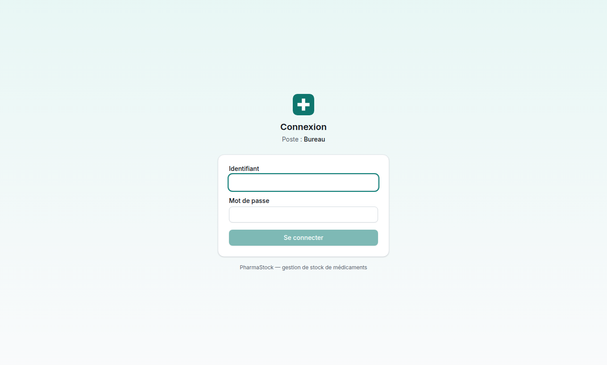

- À votre première connexion, vous devez **choisir un nouveau mot de passe** (8 caractères minimum, avec au moins une lettre et un chiffre).
- Après **5 mots de passe erronés**, le compte est verrouillé quelques minutes ; l'administrateur peut le déverrouiller.
- Vous avez aussi un **PIN** (4 à 6 chiffres). Il sert à **changer rapidement d'utilisateur** sur un poste partagé (menu en haut à droite → _Changer d'utilisateur_), à **déverrouiller l'écran** après une inactivité, et à confirmer certaines ventes si l'administrateur l'exige.
- Vous pouvez **installer PharmaStock comme une application** (icône « Installer » dans la barre d'adresse du navigateur).

### Le tableau de bord

L'accueil résume la journée. L'**administrateur** voit le chiffre d'affaires, la marge, le panier moyen, les ventes par heure, le top produits, les alertes de stock et de péremption, les créances et l'état de la caisse.
Le **préparateur** voit sa propre journée (ses ventes, sa caisse) et les alertes utiles au comptoir.

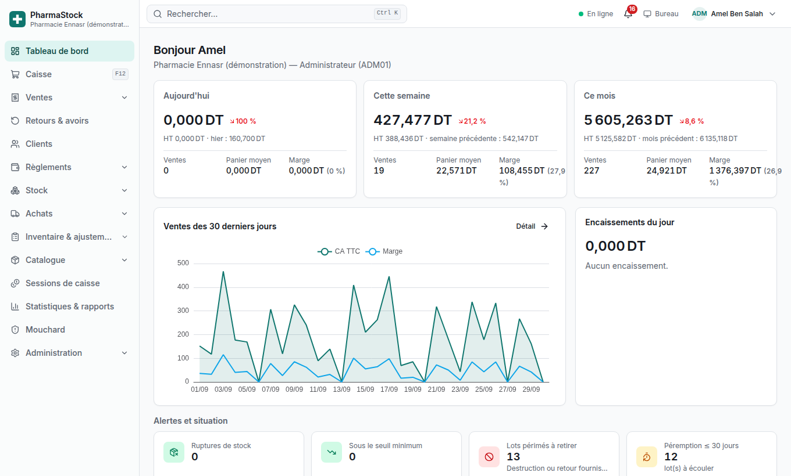

Le menu de gauche regroupe les écrans par métier ; vous ne voyez **que ce que votre rôle permet**. La recherche globale (`Ctrl + K`) retrouve un produit, un client ou une facture. La cloche affiche vos notifications.

## 2. Vendre au comptoir

Menu **Caisse** (raccourci `F12`) — c'est l'écran principal du préparateur.

> Avant de vendre en espèces, **ouvrez la caisse** de votre poste (§ 6). L'écran de vente vous y invite si nécessaire.

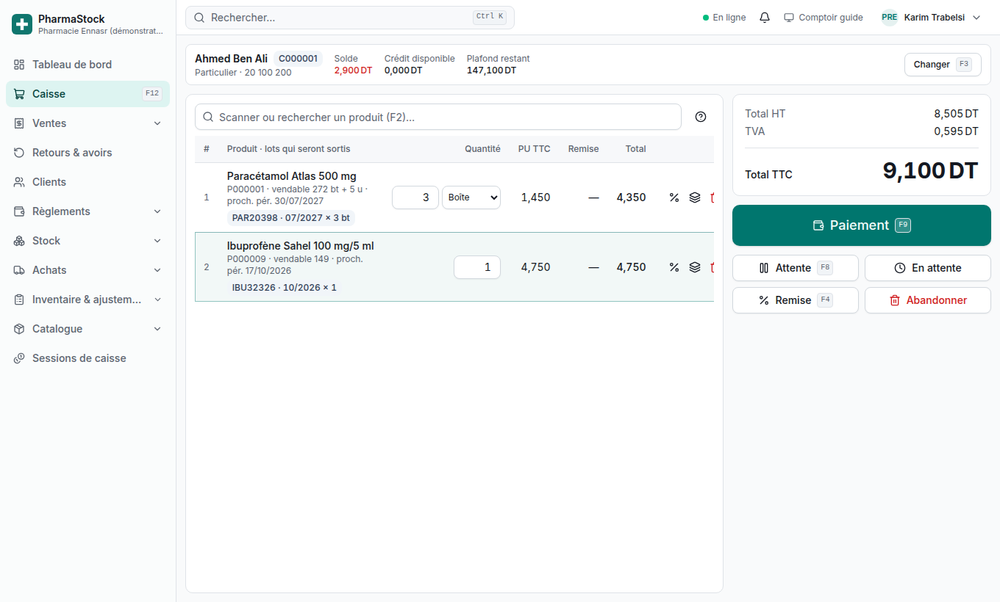

### Une vente en 5 gestes

1. **Choisir le client** (champ _Rechercher un client_, ou `F3`). Le client est obligatoire ; « Client comptoir » sert aux ventes anonymes (paiement intégral obligatoire).
   Sa fiche affiche son **solde**, son **crédit disponible** (avoirs) et son **plafond restant**.
2. **Ajouter les produits** : scannez le code-barres ou tapez quelques lettres du nom, de la molécule (DCI) ou du dosage (`F2`), puis `Entrée`.
   La recherche tolère les fautes de frappe et les accents.
3. **Ajuster** : quantité (boîtes ou unités si le produit se vend à l'unité), remise (`F4`). Le **lot est choisi automatiquement** selon la règle **FEFO** (le lot qui périme en premier sort en premier) ; vous voyez les lots qui seront sortis.
4. **Payer** (`F9`) : espèces (avec rendu de monnaie), carte, chèque, virement, traite ; plusieurs modes possibles sur une même vente ; utilisation du **crédit client** (avoir). Un reste à payer devient une **vente à crédit** sur le compte du client (dans la limite de son plafond).
5. **Valider** (`F10`) : la facture reçoit son numéro (`FAC-AAAA-NNNNNN`), le stock est décrémenté. Choisissez le document : ticket 80 mm, facture A4 ou aucun. Un e-mail avec la facture PDF part automatiquement si le client a donné son consentement.

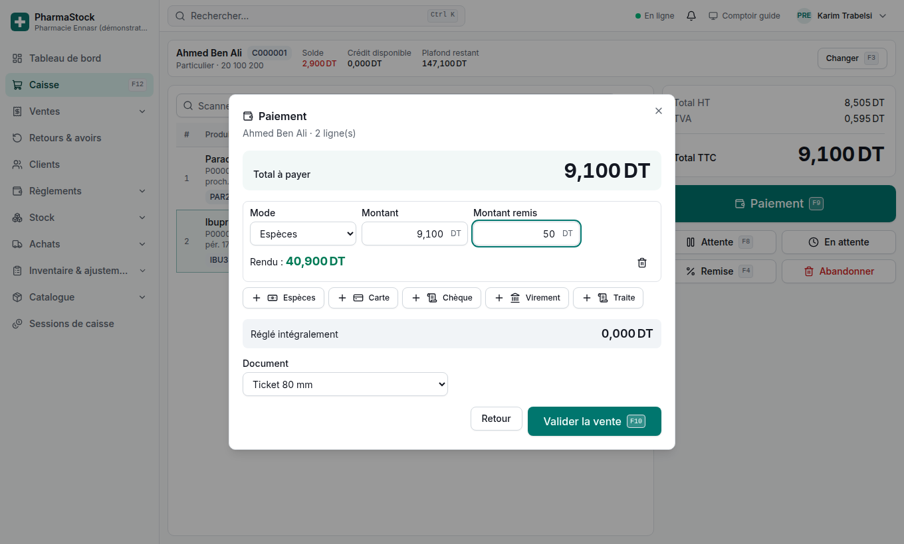

### Situations particulières

| Situation                                                                                        | Que faire                                                                                                                                                    |
| ------------------------------------------------------------------------------------------------ | ------------------------------------------------------------------------------------------------------------------------------------------------------------ |
| **Remise supérieure au plafond** de votre rôle, prix modifié, vente à crédit au-delà du plafond… | Un écran _Autorisation administrateur_ s'ouvre : l'administrateur saisit son **code**, son **PIN** et un **motif**. L'opération est tracée au mouchard (🔑). |
| **Produit sous ordonnance / à tableau**                                                          | L'écran demande les informations de l'ordonnance (prescripteur, patient). Elles alimentent le registre des stupéfiants.                                      |
| **Produit en rupture ou périmé**                                                                 | Il n'est pas vendable. Un lot bloqué (rappel, doute qualité) est ignoré.                                                                                     |
| **Mettre une vente en attente** (`F8`)                                                           | Le panier est conservé, vous servez un autre client, puis reprenez (_En attente_).                                                                           |
| **Abandonner**                                                                                   | Le panier est vidé et l'abandon est tracé.                                                                                                                   |
| **Double clic sur « Valider »**                                                                  | Sans danger : une seule facture est créée.                                                                                                                   |

### Après la vente

_Ventes → Historique_ (`/sales`) liste toutes les factures (recherche par numéro, client, période, produit, montant, statut).

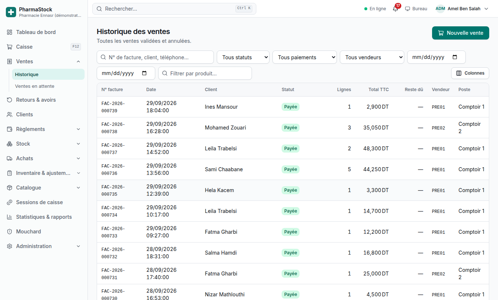

Le détail d'une vente montre les lignes, les lots sortis, les règlements, le mouchard de la vente et permet de **réimprimer** (ticket, facture A4) ou de **renvoyer par e-mail**.

- **Annuler ou modifier une vente** : réservé à l'administrateur (_Annuler la vente_, _Modifier_). Un motif est obligatoire ; le numéro reste attribué, la facture apparaît « ANNULÉE », le **stock est réintégré dans les lots d'origine** et les règlements sont remboursés ou convertis en crédit. Une vente ayant fait l'objet d'un retour ne peut plus être annulée.
- **Un client revient avec la marchandise** : voir _Retours_ (§ 5).

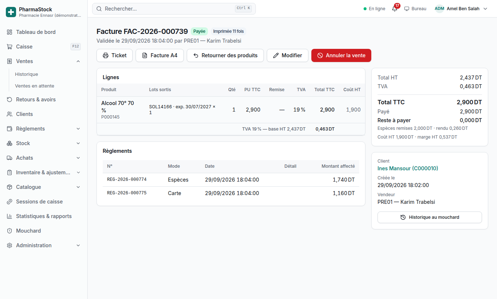

## 3. Recevoir de la marchandise

Menu **Achats → Réceptions**, puis _Nouvelle réception_. **Chaque ligne crée un lot** (numéro de lot, péremption, quantité, source).

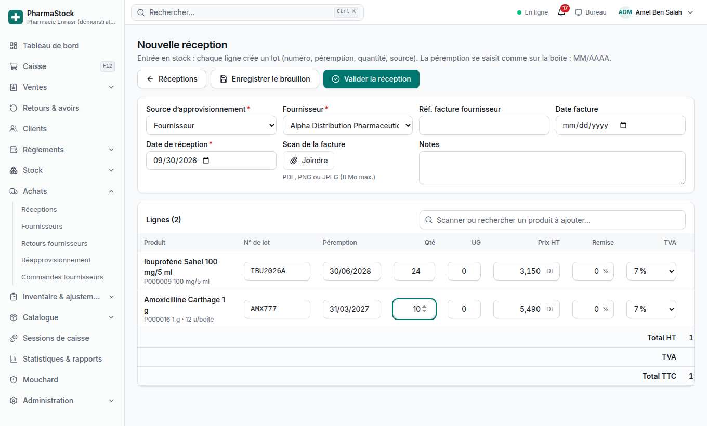

1. Choisissez la **source** (fournisseur, don, transfert…) et le **fournisseur**, renseignez la référence de la facture fournisseur et sa date. Vous pouvez joindre le scan de la facture.
2. Ajoutez les produits en scannant le code-barres ou en cherchant par nom. Pour un produit reçu en **deux lots**, ajoutez-le **deux fois**.
3. Pour chaque ligne : **numéro de lot**, **péremption** (saisie comme sur la boîte : `06/2028`), quantité, unités gratuites, prix d'achat HT, remise, TVA.
4. _Enregistrer le brouillon_ pour reprendre plus tard, ou **Valider la réception** : le stock est alimenté, le numéro `REC-AAAA-NNNNNN` est attribué. Le logiciel avertit d'une **péremption courte**, d'un **prix d'achat très différent** de la référence ou d'une **quantité inhabituelle**.
5. Une réception validée ne se modifie plus : pour corriger, on l'**annule** (administrateur, motif obligatoire) ; le stock est alors retiré tant que les lots n'ont pas été vendus.

Si la réception provient d'un **bon de commande** (§ 8), ouvrez-la depuis la commande : les lignes commandées sont pré-remplies et les écarts (surplus, produit non commandé) sont signalés.

## 4. Produits et stock

### Catalogue

**Catalogue → Produits** : recherche instantanée, filtres (catégorie, laboratoire, niveau de stock), import/export Excel. La fiche d'un produit regroupe ses caractéristiques (DCI, dosage, forme, laboratoire, TVA), ses prix (l'historique des prix est conservé), ses codes-barres, ses seuils de stock et son stock par lot.

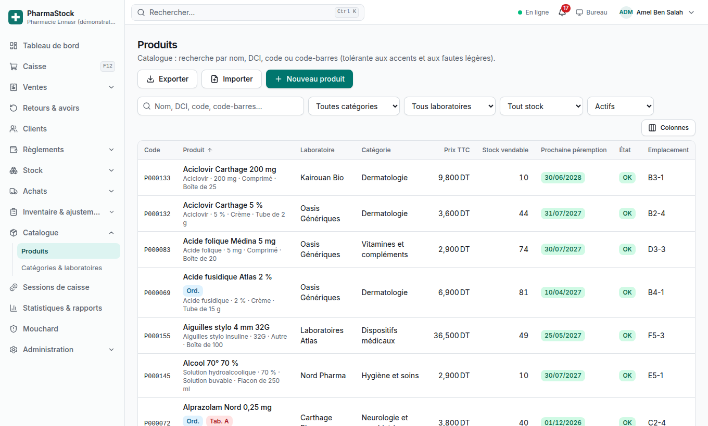

- **Nouveau produit** (droit _Gérer le catalogue_) : nom, catégorie, TVA, prix de vente TTC, conditionnement (unités par boîte, vente à l'unité). Le code interne (`P000123`) est attribué automatiquement.
- **Archiver** un produit (au lieu de le supprimer) le retire des ventes sans perdre son historique.
- Les modifications sont protégées contre les conflits : si quelqu'un a modifié la fiche pendant que vous l'éditiez, un message vous propose de recharger.
- _Catalogue → Référentiels_ : catégories, laboratoires, familles thérapeutiques, taux de TVA.

### État du stock, lots et péremptions

**Stock → État du stock** : quantité vendable, valeur (au coût et au prix de vente), niveau (OK / bas / rupture). **Lots** et **Péremptions** listent les lots par urgence (périmés, moins de 30/60/90 jours) ; l'administrateur peut **bloquer un lot** (rappel, doute qualité) pour l'exclure des ventes.
**Stock à une date** reconstitue l'état du stock à une date passée.

### Fiche de mouvement

**Stock → Fiche de mouvement** : choisissez un produit et une date de départ ; vous obtenez le **stock initial**, chaque **entrée et sortie** (date, type, document, lot, tiers, utilisateur, poste, quantité, solde) et le **stock final**. Export Excel/PDF possible. C'est l'outil de référence pour comprendre un écart.

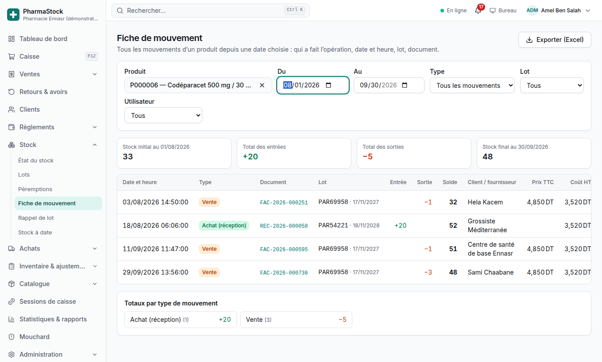

### Rappel de lot

**Stock → Rappel de lot** : saisissez un numéro de lot ; le logiciel liste où il se trouve, à quels clients il a été vendu et permet de le bloquer immédiatement.

## 5. Clients, règlements et retours

### Clients

**Clients** : particuliers, pharmacies, cliniques, hôpitaux, associations, sociétés. La fiche client comprend les coordonnées, le **plafond de crédit**, le délai de paiement, le **consentement e-mail** (indispensable pour l'envoi automatique de documents) et l'onglet **Compte** : solde, factures ouvertes, grand livre, relevé PDF, règlements.

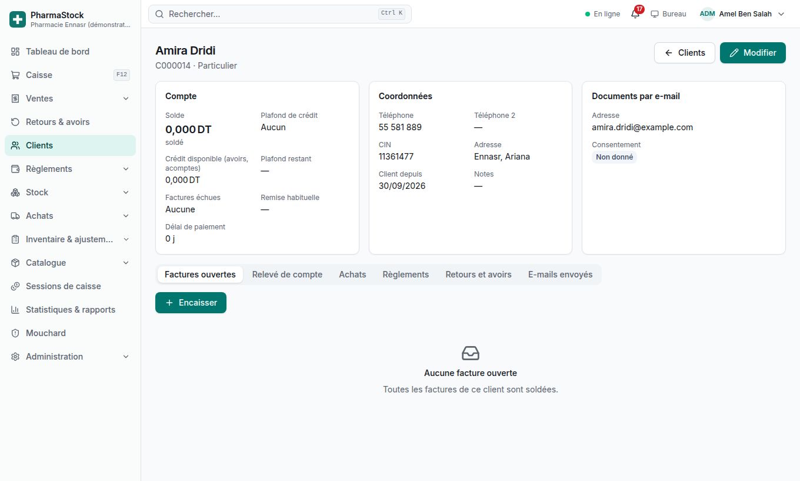

Convention : **solde positif = le client vous doit**, **solde négatif = crédit en sa faveur** (avoir).

### Encaisser un règlement

**Règlements → Règlements** puis _Nouvel encaissement_ (ou depuis la fiche client) : choisissez le client, le mode, le montant. Le **lettrage** affecte le règlement aux factures :

- _Automatique_ : les factures les plus anciennes d'abord ;
- _Manuel_ : vous répartissez facture par facture ;
- _Acompte_ : aucune facture, le montant reste en crédit sur le compte.

Un règlement partiel laisse la facture « partiellement payée » ; le solde restant est affiché partout. Les **chèques** (_Règlements → Chèques_) suivent leur cycle (reçu, déposé, encaissé, impayé) ; la **balance âgée** classe les créances par ancienneté.

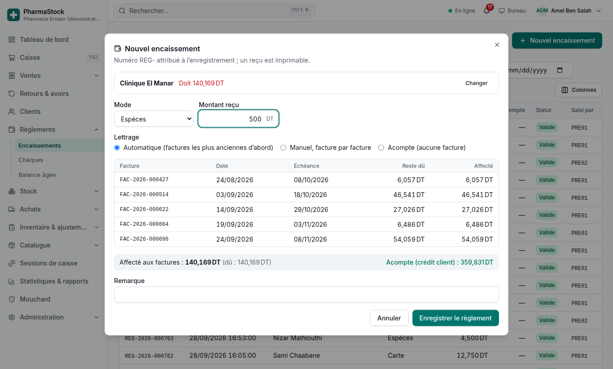

### Retours clients et avoirs

**Retours & avoirs → Nouveau retour** :

1. Retrouvez la **vente d'origine** (numéro de facture, nom ou téléphone du client).
2. Indiquez, pour chaque lot vendu, la **quantité retournée** et l'**état** du produit (intact, ouvert, endommagé…). Le montant remboursé est le **prix réellement payé** (remises comprises), au prorata.
3. Saisissez le **motif**, choisissez le remboursement : **avoir sur le compte du client** (immédiatement utilisable à la caisse) ou **espèces** (administrateur, caisse ouverte).
4. _Enregistrer le retour_ : un avoir `AV-AAAA-NNNNNN` est émis, le stock est réintégré si le produit est retournable et en bon état.

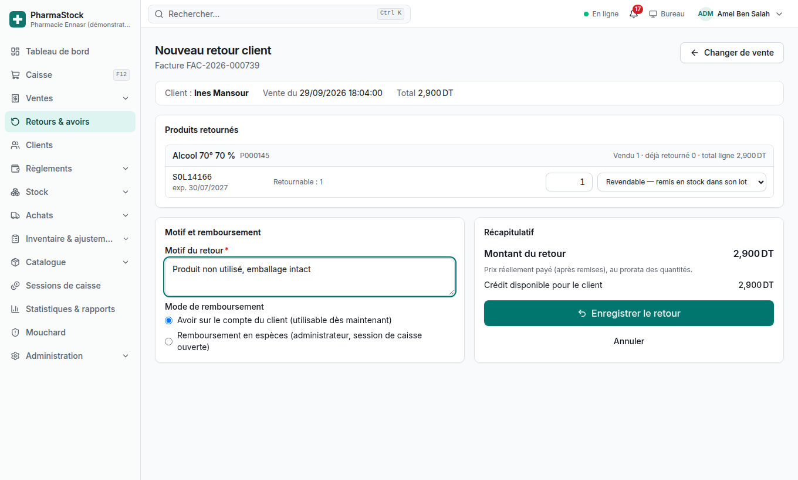

Certains retours demandent le **code administrateur** (hors délai, produit non retournable, retour d'un produit ouvert). Un retour réduit d'abord le reste à payer de la facture s'il y en a un, l'excédent devient un crédit.

## 6. Caisse

**Sessions de caisse** et **Caisse** (`F12`).

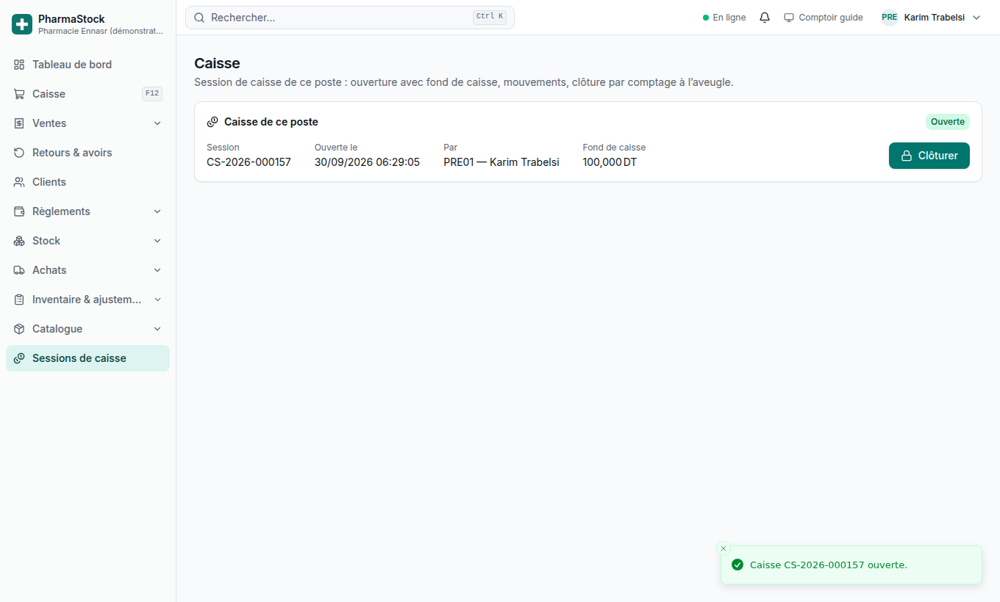

- **Ouvrir la caisse** en début de journée : saisissez le **fond de caisse** (espèces déjà dans le tiroir). Une seule caisse ouverte par poste.
- Pendant la journée, les ventes en espèces alimentent la caisse. Un **mouvement de caisse** (dépense, dépôt, retrait) se saisit avec un motif.
- **Clôturer à l'aveugle** : comptez les espèces **par coupure** (billets et pièces). Le montant théorique **n'est jamais affiché** avant la clôture : le serveur calcule l'**écart** (compté − attendu) et le trace. Un écart supérieur au seuil déclenche une alerte pour l'administrateur.
- L'administrateur consulte l'historique des sessions (écarts, comptages), imprime le **rapport X** en cours de journée et le rapport de clôture.

## 7. Inventaire et ajustements

### Inventaire

**Inventaire & ajustements → Inventaires** (administrateur pour ouvrir/valider, comptage possible par les préparateurs autorisés).

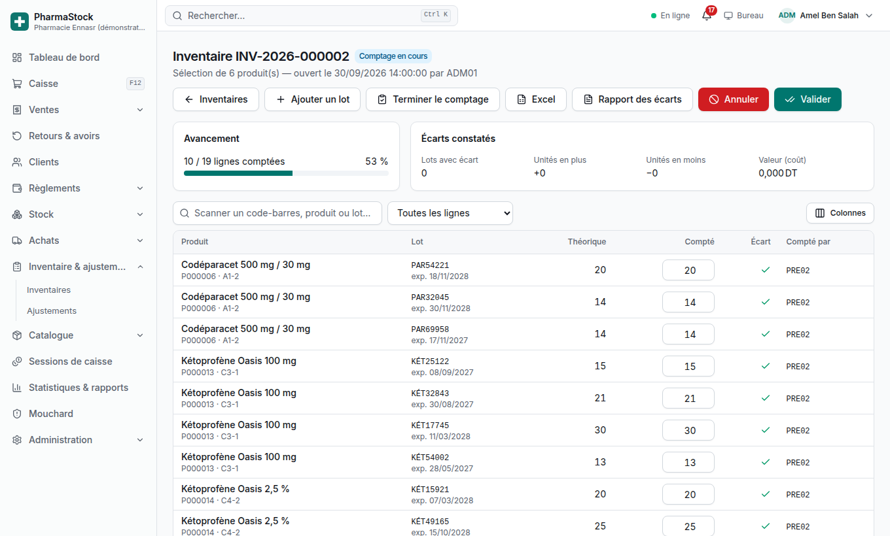

1. **Ouvrir un inventaire** : complet, par catégorie, par laboratoire, par emplacement ou **sur une sélection de produits** (inventaire partiel). Une photographie du stock par lot est prise à l'ouverture.
2. **Compter à l'aveugle** : chaque compteur saisit les quantités trouvées sans voir le stock théorique ; plusieurs postes peuvent compter en parallèle. Un lot trouvé physiquement mais absent de la liste s'ajoute avec _Ajouter un lot_.
3. **Terminer le comptage**, puis l'administrateur **valide** : le récapitulatif montre les lots en écart, les unités en plus/en moins et leur valeur. La validation génère les **ajustements de stock** (un mouvement par lot en écart) ; les ventes réalisées pendant le comptage sont prises en compte (les écarts sont relatifs).
4. Rapports Excel et PDF des écarts.

### Ajustements et pertes

**Ajustements** : casse, perte, vol, destruction de produits périmés, correction motivée. Chaque ajustement exige un motif ; au-delà d'un montant, l'autorisation de l'administrateur est demandée.

### Retours fournisseurs

**Achats → Retours fournisseurs** : retour de produits périmés ou abîmés au fournisseur. Le stock est sorti immédiatement ; le retour reste « en attente d'avoir » jusqu'à la réception de l'avoir fournisseur.

## 8. Commandes et réapprovisionnement

- **Achats → Réapprovisionnement** : suggestions calculées à partir des ventes récentes (point de commande, stock cible, délai fournisseur). Sélectionnez les lignes, puis **Créer la commande**.
- **Achats → Commandes fournisseurs** : le bon de commande (`BC-AAAA-NNNNNN`) se prépare, s'**envoie par e-mail** au fournisseur (PDF joint), se suit (envoyée, partiellement reçue, reçue) et se clôture. La réception de marchandise rattachée à la commande signale les écarts.

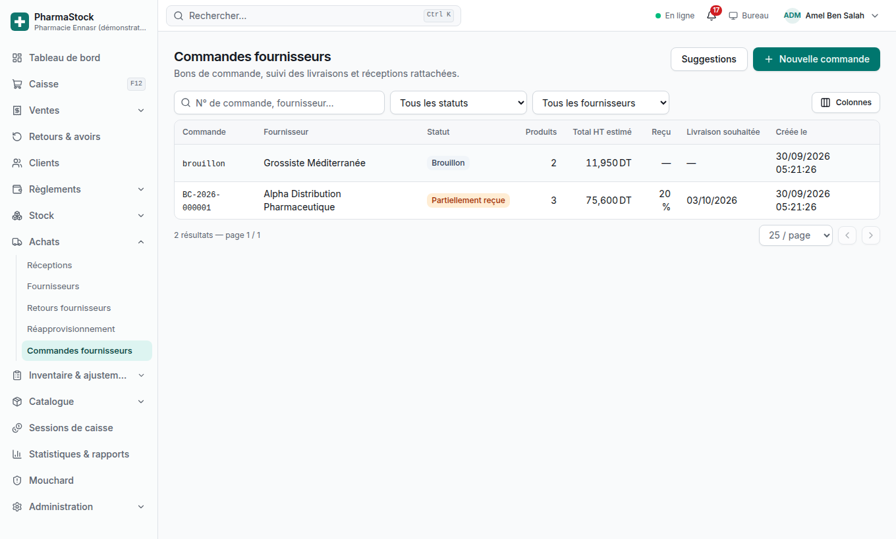

## 9. Statistiques et rapports

**Statistiques & rapports** : plus de 30 rapports regroupés par thème — ventes (par période, utilisateur, client, catégorie, laboratoire, moyen de paiement, heures d'affluence), produits (meilleures ventes, marges, rotation, stock dormant, valeur des péremptions, pertes), achats, retours, créances (balance âgée, principaux débiteurs), caisse (écarts) et journaux légaux (ventes, achats, règlements, TVA, registre des stupéfiants, traçabilité d'un lot).

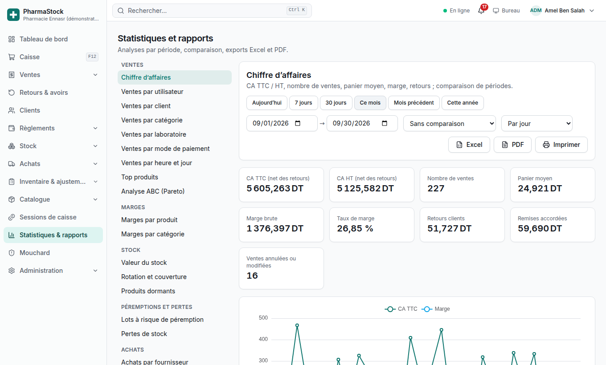

Chaque rapport propose une **période**, des **filtres**, une **comparaison** avec la période précédente, un **graphique** et un **export Excel ou PDF** (chaque export est tracé au mouchard). Les montants de coûts et de marges ne sont visibles qu'avec le droit correspondant.

## 10. Mouchard (journal infalsifiable)

**Mouchard** (administrateur) enregistre **qui a fait quoi, quand, depuis quel poste** : connexions, ventes annulées ou modifiées, remises hors plafond, codes administrateur, lignes retirées d'un panier, ajustements, modifications de paramètres, exports, sauvegardes…

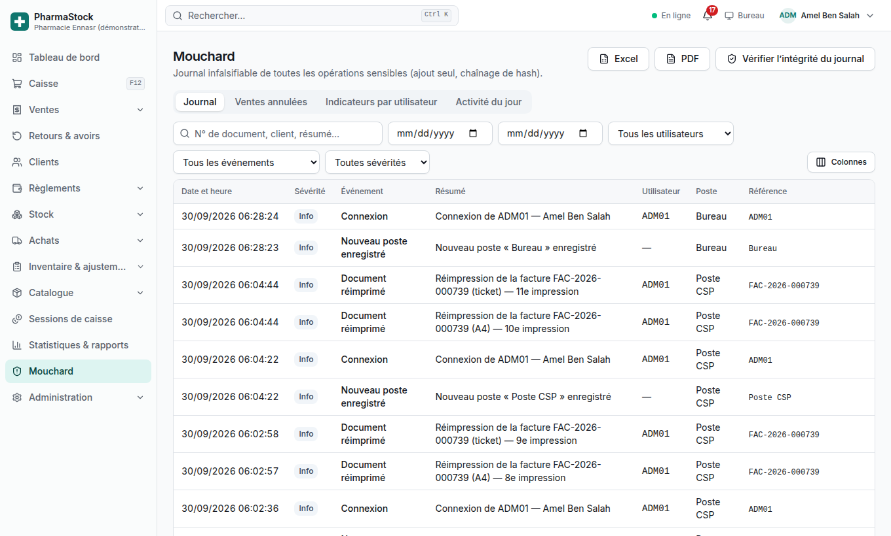

- Chaque entrée est **chaînée par empreinte** (hachage) à la précédente et la base **interdit toute modification ou suppression** : une altération est détectée (onglet _Intégrité_, vérification hebdomadaire automatique).
- Onglets utiles : **Journal** (recherche, filtres par gravité, utilisateur, période), **Ventes annulées**, **Indicateurs** (remises hors plafond, lignes retirées par employé), **Activité** (rapport quotidien par employé).
- Les événements **critiques** (annulation, remise hors plafond, écart de caisse, incohérence de stock…) déclenchent une notification.

## 11. Notifications et e-mails

- **La cloche** (en haut) liste vos notifications dans le logiciel.
- **Mes notifications** (menu utilisateur) : pour chaque type d'événement, choisissez le mode — _désactivé_, _dans le logiciel uniquement_, _e-mail immédiat_, _résumé quotidien_ ou _résumé hebdomadaire_ —, les **employés suivis**, les **seuils** (montant, remise) et l'heure d'envoi des résumés. Le **rapport d'activité quotidien** par employé peut être reçu chaque soir.

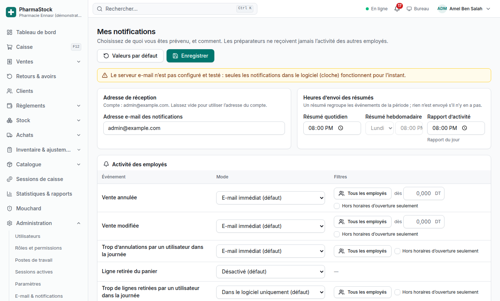

- **Factures par e-mail** : envoyées automatiquement aux clients qui ont donné leur **consentement**, avec le PDF en pièce jointe (aucun nom de médicament dans le corps du message). Si le serveur de messagerie est en panne, **la vente est validée quand même** et l'e-mail part tout seul dès que la messagerie est rétablie (_Administration → Journal des e-mails_ pour suivre ou renvoyer).

## 12. Administration

Réservé à l'administrateur (menu **Administration**).

| Écran                      | Usage                                                                                                                                                                                                                                                                                                               |
| -------------------------- | ------------------------------------------------------------------------------------------------------------------------------------------------------------------------------------------------------------------------------------------------------------------------------------------------------------------- |
| **Utilisateurs**           | Créer un compte, choisir son rôle, réinitialiser le mot de passe/PIN, désactiver (jamais supprimer : l'historique est conservé). Le dernier administrateur ne peut pas être désactivé.                                                                                                                              |
| **Rôles et permissions**   | Composer des rôles sur mesure parmi une soixantaine de permissions (vendre, remiser, annuler, voir les coûts, inventorier…). Les rôles _Administrateur_ et _Préparateur_ sont fournis.                                                                                                                              |
| **Postes de travail**      | Approuver ou révoquer les ordinateurs autorisés à se connecter.                                                                                                                                                                                                                                                     |
| **Sessions actives**       | Voir les utilisateurs connectés et fermer une session à distance.                                                                                                                                                                                                                                                   |
| **Paramètres**             | Établissement (nom, adresse, identifiants fiscaux, en-tête des documents), TVA, numérotation, plafonds de remise et de crédit, horaires d'ouverture, règle de sortie des lots (FEFO/FIFO), seuils de péremption et de stock, coupures de caisse, retours (délais, motifs), impression… Chaque changement est tracé. |
| **E-mail & notifications** | Serveur SMTP, test de connexion, modèles d'e-mails (personnalisables).                                                                                                                                                                                                                                              |
| **Journal des e-mails**    | Tous les envois, leur statut et les erreurs ; renvoi manuel.                                                                                                                                                                                                                                                        |
| **Tâches planifiées**      | Contrôles et alertes automatiques ; lancement à la demande.                                                                                                                                                                                                                                                         |
| **Sauvegardes**            | Historique, sauvegarde immédiate, téléchargement, état de la copie hors site.                                                                                                                                                                                                                                       |

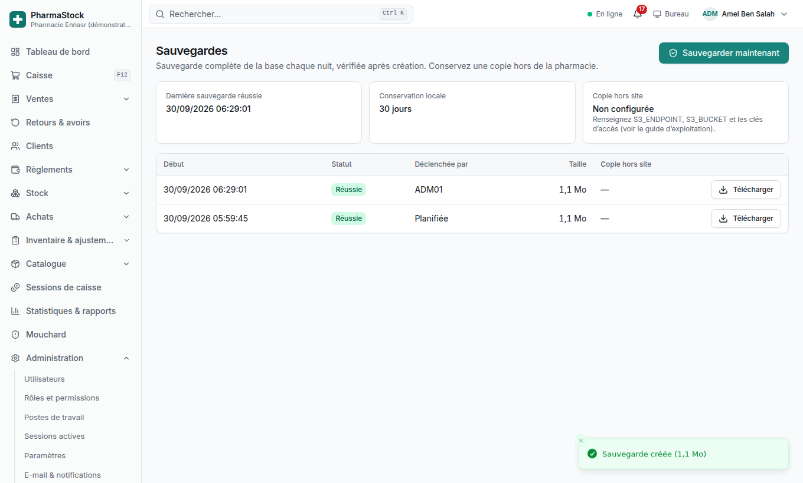

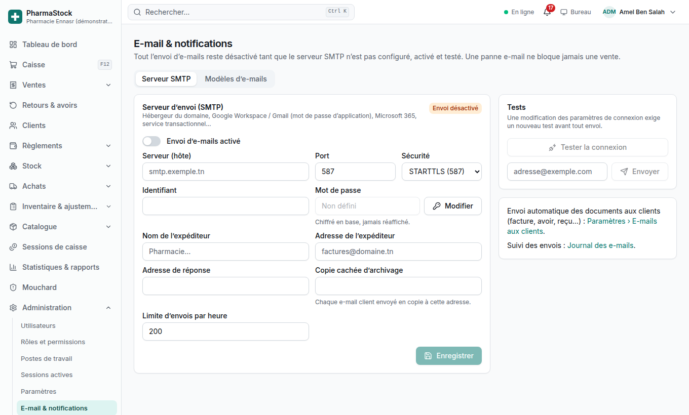

## 13. Raccourcis clavier

| Touche                         | Action (écran de vente)                                                               |
| ------------------------------ | ------------------------------------------------------------------------------------- |
| `F2`                           | Aller au champ de recherche de produit                                                |
| `F3`                           | Changer de client                                                                     |
| `F4`                           | Remise / prix de la ligne sélectionnée                                                |
| `F8`                           | Mettre la vente en attente                                                            |
| `F9`                           | Paiement                                                                              |
| `F10`                          | Valider la vente                                                                      |
| `F12`                          | Ouvrir l'écran de caisse                                                              |
| `Ctrl + K`                     | Recherche globale                                                                     |
| `Entrée` dans le champ produit | Ajouter le produit trouvé (un lecteur de code-barres envoie `Entrée` automatiquement) |

## 14. Questions fréquentes

**Je ne peux pas vendre : « Aucune caisse ouverte ».** Ouvrez la caisse de votre poste (_Caisse → Ouvrir la caisse_, fond de caisse).

**Un produit n'apparaît pas à la vente.** Il est peut-être en rupture, périmé, dans un lot bloqué, ou archivé. Consultez sa fiche (stock par lot).

**Le lot proposé n'est pas celui que je veux.** Le logiciel sort le lot qui périme en premier (FEFO). Un préparateur peut forcer un lot si le droit lui est accordé ; l'action est tracée.

**J'ai fait une erreur sur une vente déjà validée.** Demandez à l'administrateur de l'annuler ou de la modifier (motif obligatoire). Si le client est parti avec la marchandise, faites un retour.

**Le client veut payer plus tard.** Retirez le règlement dans l'écran de paiement : le montant devient une vente à crédit sur son compte (dans la limite du plafond ; au-delà, l'administrateur doit autoriser).

**Le rendu de monnaie est faux.** Vérifiez « Montant remis » (ce que le client vous a donné) : le rendu = remis − à payer.

**J'ai oublié mon mot de passe.** L'administrateur le réinitialise (_Administration → Utilisateurs_) ; vous en choisissez un nouveau à la prochaine connexion.

**L'écran est verrouillé.** Saisissez votre PIN. Après plusieurs erreurs, reconnectez-vous avec votre mot de passe.

**L'écart de caisse est apparu à la clôture.** Il est calculé par le serveur et transmis à l'administrateur. Ne recommencez pas la clôture : signalez l'incident ; l'administrateur peut retracer chaque mouvement de la session.

**Une alerte « Incohérence de stock » est arrivée.** Prévenez l'administrateur. Ne corrigez pas au hasard : ouvrez la fiche de mouvement du lot concerné pour comprendre, puis faites un ajustement motivé.

## Aide, manuels et application

- **Bouton « ? »** en haut de chaque écran (ou touche **F1**) : explique l'écran où vous êtes, pas à pas. La **page Aide**
  (menu _Aide_) rassemble la FAQ « Que faire si… », le guide par écran, les raccourcis et la fiche mémo.
- **Visite guidée** au premier lancement ; elle se relance depuis le bouton « ? » ou la page Aide.
- **Manuels PDF** (Administrateur, Préparateur), **aide-mémoire d'une page** à imprimer et **FAQ** : page _Aide → Manuels PDF_
  (fichiers dans `docs/manuels/`).
- **Sur téléphone** : ouvrez le site dans Chrome (Android) ou Safari (iPhone) et touchez **Installer** en haut à droite :
  l'icône s'ajoute à l'écran d'accueil, sans passer par un magasin d'applications.
- **Sur le poste de caisse Windows** : l'application PharmaStock imprime les tickets sans boîte de dialogue et ouvre le
  tiroir-caisse (`docs/DESKTOP.md`).
